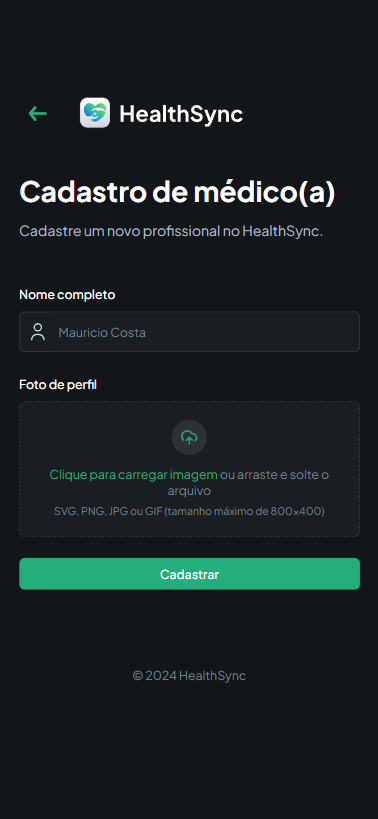

<h1 align="center">HealthSync</h1>

  
  
  

> 
A web application for scheduling and managing patient appointments, designed to streamline the consultation process for hospitals.

<h2 align="center">Content</h2>

<a href="#rocket-features">Features</a>
·
<a href="#gear-technologies">Technologies</a>
·
<a href="#camera-preview">Preview</a>
·
<a href="#question-how-to-test">How to Test</a>
·
<a href="#copyright-license">License</a>

# :rocket: Features

:iphone: Mobile Ready

### As user

- Create new appointments, providing personal and medical information

- Receive a SMS text when the appointment is confirmed or canceled

### As admin

- Administrative panel to manage appointments and doctors
  - Access by entering a passcode, which will be stored in cookies for future sessions
  - Create new doctor
  - Edit an existing doctor
  - Delete a doctor
  - Overview of appointment statuses, displaying the number of appointments for each status
  - A list of appointments, each containing essential information such as the patient's name, doctor's name, status, and actions for managing the appointment
  - Confirm an appointment, tagging as "Scheduled" and sending a SMS text to the patient
  - Cancel an appointment, tagging as "Cancelled" and sending a SMS text to the patient

# :gear: Technologies

### Frontend

- [ReactJS](https://github.com/facebook/react) v18
- [NextJS](https://github.com/vercel/next.js) v14.2.15
- [TailwindCSS](https://github.com/tailwindlabs/tailwindcss)
- [React Hook Form](https://github.com/react-hook-form/react-hook-form)
- [Zod](https://github.com/colinhacks/zod)
- [React Datepicker](https://github.com/Hacker0x01/react-datepicker)
- [React Dropzone](https://github.com/react-dropzone/react-dropzone)
- [React Phone Number Input](https://gitlab.com/catamphetamine/react-phone-number-input)
- [Shadcn](https://github.com/shadcn/ui)

### Backend and Database

- [Appwrite](https://github.com/appwrite/appwrite)

### Languages and Tools

- [NodeJS](https://github.com/nodejs)
- [Typescript](https://github.com/microsoft/TypeScript)
- [VSCode](https://github.com/microsoft/vscode)
- [ESLint](https://github.com/eslint/eslint)
- [Prettier](https://github.com/prettier/prettier)

### Monitoring and Messaging

- [Sentry](https://github.com/getsentry/sentry)
- [Twilio](https://github.com/twilio/twilio-node)

### Deploy

- [Vercel](https://github.com/vercel/vercel)

### Documentation - not implemented yet

- [Storybook](https://github.com/storybookjs/storybook)

### Tests - not implemented yet

- [Vitest](https://github.com/vitest-dev/vitest)
- [React Testing Library](https://github.com/testing-library/react-testing-library)

# :camera: Preview

Desktop

### Step 1 - Register user

  

### Step 2 - Register patient

  

### Step 3 - Create appointment

  

### Success

  

### Enter Admin passcode

  

### Admin dashboard

  

### Schedule appointment

  

### Cancel appointment

  

### Doctors dashboard

  

### Create new doctor

  

### Update existing doctor

  

### Delete doctor

  

### 404

   

Mobile

### Step 1 - Register user

  

### Step 2 - Register patient

  

### Step 3 - Create appointment

  

### Success

  
 
### Enter passcode

  

### Admin dashboard

  

### Schedule appointment

  

### Cancel appointment

  

### Doctors dashboard

  

### Create new doctor

  

### Update existing doctor

  

### Delete doctor

  
    
  ### 404

   

# :question: How to test

### This project is deployed on Vercel

[You can test it by clicking here](https://healthsync-seven.vercel.app/)

:warning: The passcode to access the admin page is <strong>123456</strong>.
 
:warning: The app may experience slower performance due to the use of the free version of Appwrite.
 
:warning: The SMS text function is limited due to the free version of Twilio. Messages can only be sent to phone numbers defined in the Twilio account.

# :copyright: License

This project is under the [MIT license](./LICENSE).

The design of this application was based on the work of <a href="https://www.linkedin.com/in/adrianhajdin/">Adrian Hajdin</a>
 
Made with ❤︎ by <a href="https://github.com/vitorquadros">Vítor Quadros</a>

